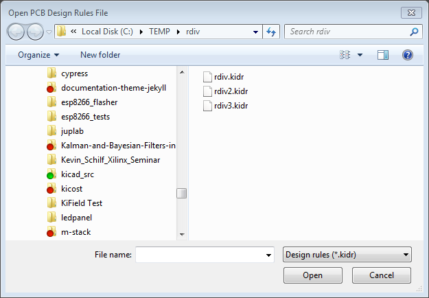
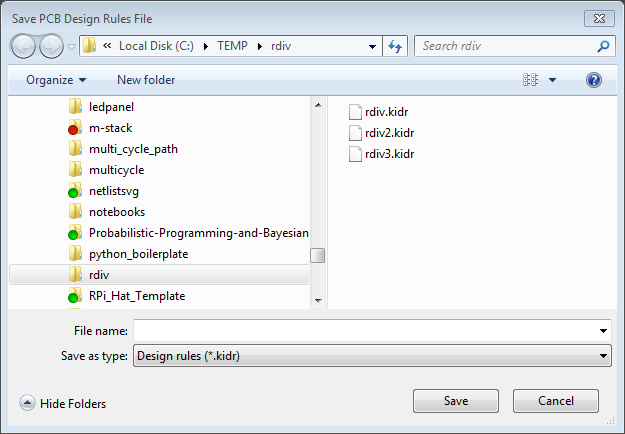

# DRMgr Plugin

This PCBNEW plugin lets you save and restore the board settings for a PCB.
This is useful for storing the design rules of a particular PCB fab and then
applying them to an existing or new project.

* Free software: MIT license

## Features

* Save current PCBNEW board settings into a file.
* Apply board settings from a file into a current PCBNEW session.

## Installation

Just copy `DRMgr.py` file to one of the following directories:

* Windows: `kicad/share/kicad/scripting/plugins`.
* Linux: `kicad/scripting/plugins`.

You will also have to install the [KinJector Python package](https://github.com/xesscorp/kinjector) using these
[instructions](https://xesscorp.github.io/kinjector/docs/_build/singlehtml/index.html).

## Usage

The plugin is started by pressing the `Tools => External Plugins... => DRMgr` button.
This brings up a small window with three buttons:

* `Open`: Opens a file containing board settings and applies them to the current board.
* `Save`: Stores the settings for the current board into a file.
* `Cancel`: Oh, just forget it!

### Applying Design Rules

Pressing the `Open` button brings up the following window:

Selecting a design rule file (having the default suffix of `.kidr`) and then clicking the
`Open` button will apply the settings in the file to the board currently open
in PCBNEW.
 

### Saving Design Rules

Pressing the `Save` button brings up the following window:

Selecting a design rule file or typing a file name and then clicking the
`Save` button will load the file with all the settings for the board currently open
in PCBNEW.

### Editing Design Rules

The `Save` operation will create a file storing *all* the settings for the
current board.
If you do not want to apply some of these settings (e.g., layer visibility flags
or net class assignments), just open the file and delete those fields.

If you want more detailed control of the design rules, it's usually
easier to open the file in PCBNEW, make changes in the
`File => Board Setup...` dialog, and then save the altered board settings
into the original file or a new file.

### Caveats

Due to deficiencies in the PCBNEW Python API, DRMgr is currently unable to 
store or update design rules for the following board features:

* Text and graphic dimensions for all layers,
* Widths, gaps, and via gaps for pre-defined differential pairs.

## Credits

### Development Lead

* XESS Corp. <info@xess.com>

### Contributors

None yet. Why not be the first?

## History

### 0.1.0 (2019-06-08)

* First release.
